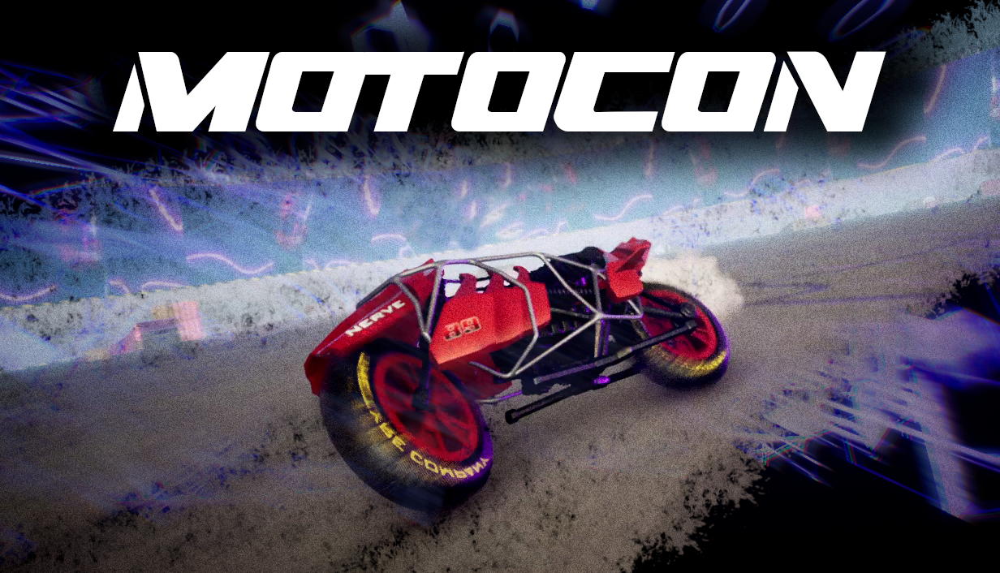
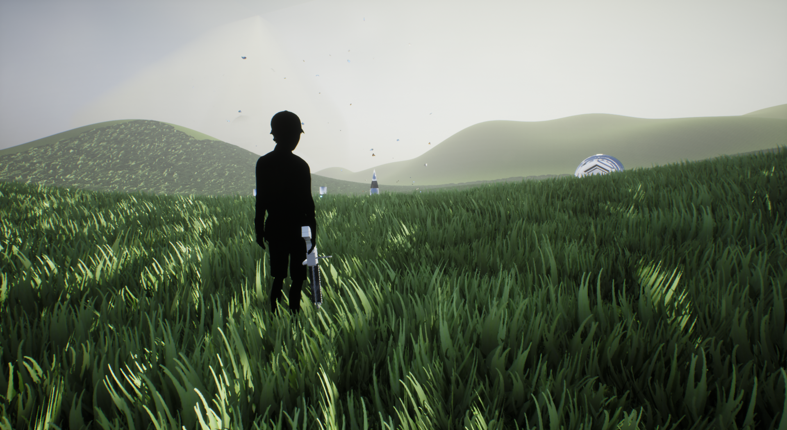

# Protoria Studios Public

> We publicly host our policies and press assets here so that changes are easy and transparent for everyone. Consider this entire repository our press kit. Feel free to use any of its contents for your media or info purposes.

  

## About us

Protoria Studios is a small computer entertainment studio based across the Eastern US, shipping video games, music, assets, and software since 2016. Guided by gameplay-first design, precise art direction, and a focus on lasting playability, Protoria Studios is committed to creating novel entertainment that lasts forever. Games are mostly just made by https://github.com/telekrex, with additional part-time contributors depending on the project. We operate fully remote on a small budget.

Though our primary thing is making our own video games, we also offer [prototyping services](https://www.protoriastudios.com/prototypes), and often write custom software. Sometimes we share it.

## Mission

Even if many of our games and products may interact with the Internet, we're committed to making sure they work without it, and continue to work when technology evolves around it. We believe you should fully own your ability to use software that's sitting on your hard drive. Offline first, networked second, runs on your machine, no sign-up required, just run the .exe. We also quite like big head mode.

## Links
[Website](https://www.protoriastudios.com) | 
[Press Kit](https://github.com/Protoria-Studios/protoria-studios-public/tree/main/press-kit) | 
[GitHub](https://github.com/Protoria-Studios) | 
[Steam](https://store.steampowered.com/search/?developer=Protoria%20Studios) | 
[YouTube](https://www.youtube.com/@protoriastudios) | 
[Discord](https://discord.gg/XZMc5KMVFY) | 
[Instagram](https://www.instagram.com/protoriastudios) | 
[GameJolt](https://gamejolt.com/@protoriastudios) | 
[X/Twitter](https://x.com/ProtoriaStudios) | 
[Itch.io](https://protoriastudios.itch.io/)

Contact: [protoriastudios@gmail.com](mailto:protoriastudios@gmail.com)

## Products

### [Skyfear, dragon arena shooter](https://store.steampowered.com/app/814330/Skyfear/)  

### [Motocon, motorcycle combat (coming soon)](https://store.steampowered.com/app/4098490/Motocon/)  
  

### [Optimum Link, lucid dream sandbox](https://store.steampowered.com/app/941120/Optimum_Link/)  

### [Adventures in the Light & Dark VR](https://store.steampowered.com/app/841790/Adventures_in_the_Light__Dark/)  
  

### [Antique chess figures photogrammetry](https://protoriastudios.itch.io/photogrammetry-chess-figures-ue4)

