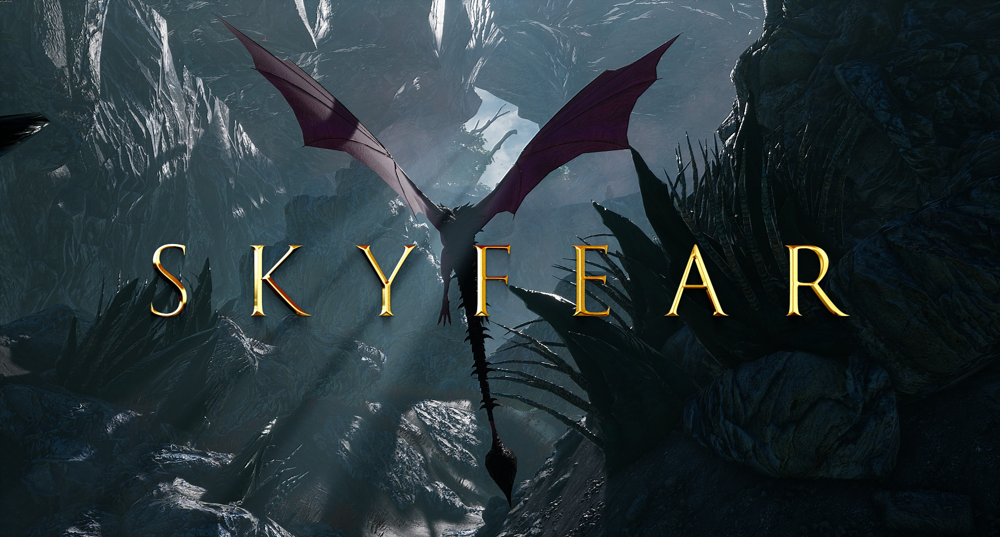
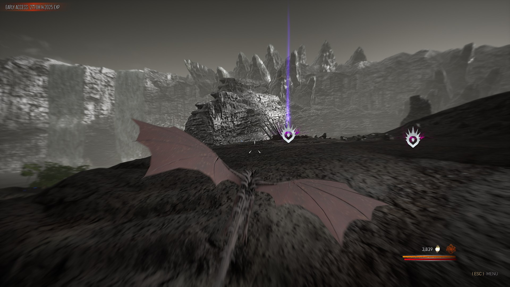
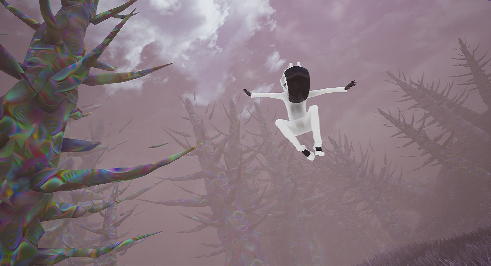
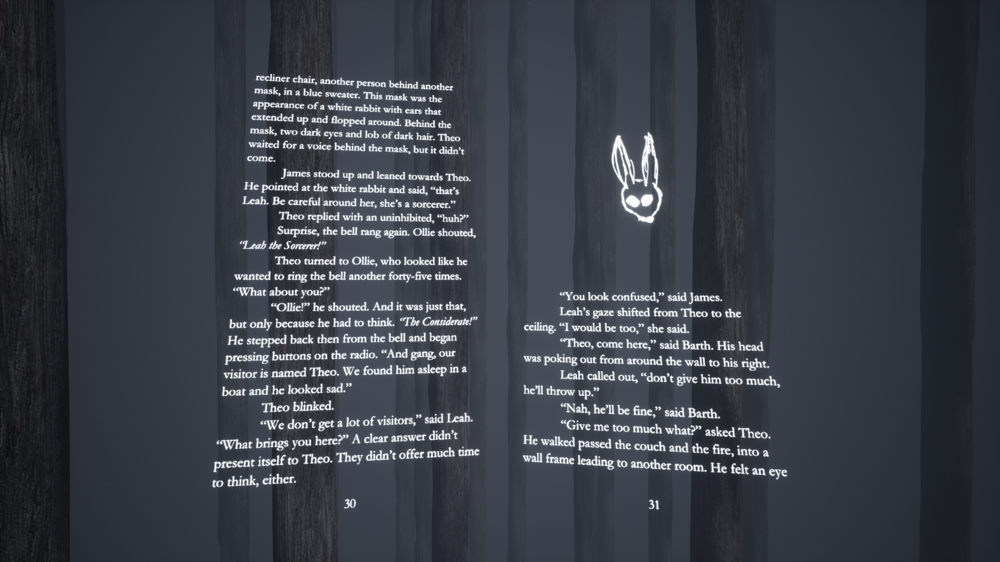

## About

Protoria Studios is a small computer entertainment studio based acrossed the Eastern US, shipping video games, music, assets, and software since 2016. Guided by gameplay-first design, precise art direction, and a focus on lasting playability, Protoria Studios is committed to creating novel entertainment that lasts forever. We are a team of primarily 1-2, with +1-2 part time members, which varies by project. We operate fully remote on a small budget.

We also offer [prototyping services](https://www.protoriastudios.com/prototypes) for game developers and publishers. We also develop software. Mostly for our own purposes, but sometimes we share it or sell it.

Links:
[Website](https://www.protoriastudios.com) | 
[Press Kit](https://github.com/Protoria-Studios/protoria-studios-public/tree/main/press-kit) | 
[GitHub](https://github.com/Protoria-Studios) | 
[Steam](https://store.steampowered.com/search/?developer=Protoria%20Studios) | 
[YouTube](https://www.youtube.com/@protoriastudios) | 
[Discord](https://discord.gg/XZMc5KMVFY) | 
[Instagram](https://www.instagram.com/protoriastudios) | 
[GameJolt](https://gamejolt.com/@protoriastudios) | 
[X/Twitter](https://x.com/ProtoriaStudios) | 
[Itch.io](https://protoriastudios.itch.io/)

Contact: [protoriastudios@gmail.com](mailto:protoriastudios@gmail.com)

Main products:  

### [Skyfear, dragon arena shooter](https://store.steampowered.com/app/814330/Skyfear/)  
   

### [Motocon, motorcycle combat (coming soon)](https://store.steampowered.com/app/4098490/Motocon/)  
  

### [Optimum Link, lucid dream sandbox](https://store.steampowered.com/app/941120/Optimum_Link/)  
   

### [Adventures in the Light & Dark VR](https://store.steampowered.com/app/841790/Adventures_in_the_Light__Dark/)  
  

### [Antique chess figures photogrammetry](https://protoriastudios.itch.io/photogrammetry-chess-figures-ue4)
